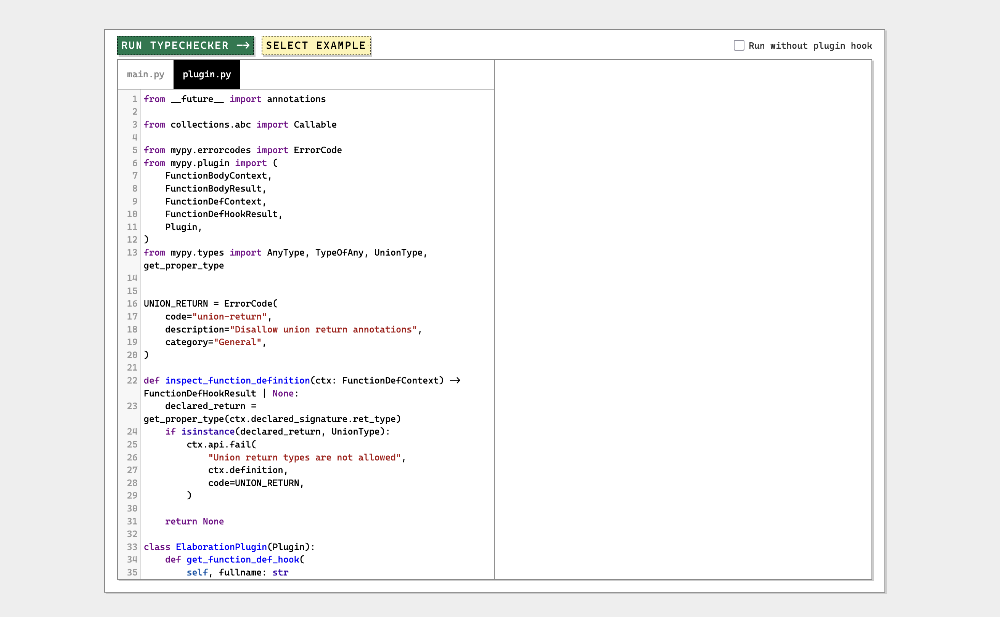

## Plugin playground

### WIP

Plugin playground, extends mypy plugins.
[fork](https://github.com/python/mypy/pull/21951)

Installation

- `pip install -r requirements.txt # in virtual env`
- `uvicorn src.main:app --reload --port 8080`

